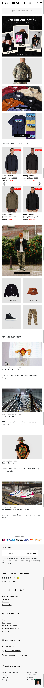

# Procesverslag
**Auteur:** Quemio Zegwaard

Markdown cheat cheet: [Hulp bij het schrijven van Markdown](https://github.com/adam-p/markdown-here/wiki/Markdown-Cheatsheet). Nb. de standaardstructuur en de spartaanse opmaak zijn helemaal prima. Het gaat om de inhoud van je procesverslag. Besteedt de tijd voor pracht en praal aan je website.

## Bronnenlijst
1. -bron 1-
2. -bron 2-
3. -...-

## Eindgesprek (week 7/8)

-dit ging goed & dit was lastig-

Ik heb veel moeite met het in elkaar krijgen van mijn header en de productpagina en ik besteed nu veel te veel tijd aan de styling terwijl ik ook nog javascript, microinteracties en accesability moet maken.
**Screenshot(s):**

-screenshot(s) van je eindresultaat-

## Voortgang 3 (week 6)

-same as voortgang 1-

## Voortgang 2 (week 5)

-same as voortgang 1-

## Voortgang 1 (week 3)

### Stand van zaken

-dit ging goed & dit was lastig-

Het stijlen ging redelijk snel en goed. Ik heb wel problemen gehad met het uploaden op github maar uiteindelijk is dat wel gelukt. Mijn afbeeldingen komen helaas niet door via github dus ik moet nog even kijken of ik de afbeeldingen wel correct heb gelinkt.

**Screenshot(s):**

-screenshot(s) van hoe ver je bent-

(images/voortgang/week3/voortgang week 3.png)

### Agenda voor meeting

-samen met je groepje opstellen-

### Verslag van meeting

-na afloop snel uitkomsten vastleggen-

## Intake (week 1)

**Je startniveau:** - rood

**Je focus:** -responsive-

**Je opdracht:** https://www.freshcotton.com/nl/

**Screenshot(s):**

**Breakdown-schets(en):**

